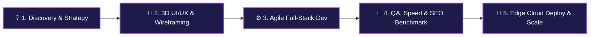

<div align="center">

<!-- 3D DYNAMIC WAVING HEADER -->


<!-- COMPACT LOGO WITH GLOW -->
<a href="https://solution-tech1.github.io/SolutionTech-Portfolio/">
  
</a>

<br/>

<!-- DYNAMIC TYPING SVG SLOGAN -->


<br/>

<!-- 3D QUICK CONNECT BADGES -->
<p align="center">
  <a href="https://solution-tech1.github.io/SolutionTech-Portfolio/">
    
  </a>
  &nbsp;
  <a href="mailto:solution.tech.1214@gmail.com">
    
  </a>
  &nbsp;
  <a href="https://wa.me/923292179603">
    
  </a>
</p>

---

</div>

## 🏢 Who We Are

**Solution Tech** is an agile, engineering-first digital agency headquartered in Karachi, Pakistan, partnering with startups and enterprises across the globe (USA, UK, Australia & Worldwide).

```
⚡ What We Do:
├── 🚀 Full-Stack Web Platforms (React, Next.js 15, Node.js, MERN)
├── 🤖 Custom AI Agents & LLM Integrations (Gemini API, OpenAI, RAG)
├── 🛍️ High-Conversion E-Commerce Stores (Custom MERN & Shopify Liquid)
├── 🎨 Modern 3D & Micro-Animated UI/UX (Tailwind, Framer Motion, 60FPS Canvas)
└── 📈 Performance Marketing, SEO & Global Scaling Strategy
```

---

## 🛠️ Dynamic Tech Stack & Tooling

<div align="center">

### 🎨 Frontend & UI Architecture
<a href="https://skillicons.dev">
  
</a>

<br/><br/>

### ⚙️ Backend, APIs & Authentication
<a href="https://skillicons.dev">
  
</a>

<br/><br/>

### 🗄️ Databases, Cloud & Storage
<a href="https://skillicons.dev">
  
</a>

<br/><br/>

### 🛍️ CMS & E-Commerce Frameworks
<a href="https://skillicons.dev">
  
</a>

<br/><br/>

### 🚀 DevOps, Tools & Creative Design
<a href="https://skillicons.dev">
  
</a>

</div>

---

## 👥 Meet the Engineering & Growth Team

<table align="center" width="100%">
  <thead>
    <tr style="background: rgba(168, 85, 247, 0.15);">
      <th align="left">👤 Member</th>
      <th align="left">🎯 Official Role</th>
      <th align="left">💻 Core Specialization</th>
      <th align="left">🎓 Background & Experience</th>
    </tr>
  </thead>
  <tbody>
    <tr>
      <td><b>M Raza Rajput</b></td>
      <td><code>CEO & Full-Stack Lead</code></td>
      <td>Next.js 15, MERN Stack, Gemini AI Integration & System Architecture</td>
      <td>Intermediate in CS &bull; <b>2+ Years Exp</b></td>
    </tr>
    <tr>
      <td><b>Abdul Rafay</b></td>
      <td><code>Digital Marketing & Growth Lead</code></td>
      <td>Performance Marketing, Brand Outreach, UI/UX Strategy & Growth Funnels</td>
      <td>Intermediate in CS &bull; <b>6 Months Exp</b></td>
    </tr>
    <tr>
      <td><b>Hamza Shamsi</b></td>
      <td><code>Full-Stack Dev & Client Lead</code></td>
      <td>Client Solutions Engineering, Full-Stack Delivery & Data Integrity</td>
      <td>Intermediate in Commerce &bull; <b>1 Year Exp</b></td>
    </tr>
    <tr>
      <td><b>Aliyan Kaleem</b></td>
      <td><code>Frontend Engineer</code></td>
      <td>Interactive UI Design, Responsive Components & Modern Styling</td>
      <td>Doing Intermediate &bull; <b>Frontend Specialist</b></td>
    </tr>
    <tr>
      <td><b>Abdul Rehman</b></td>
      <td><code>MERN Stack Developer</code></td>
      <td>REST API Engineering, MongoDB Schemas & Frontend Integration</td>
      <td>Doing Intermediate &bull; <b>MERN Developer</b></td>
    </tr>
    <tr>
      <td><b>M Talha</b></td>
      <td><code>CMS & E-Commerce Architect</code></td>
      <td>Shopify Liquid Storefronts, Custom WordPress & WooCommerce Systems</td>
      <td>Commerce Architecture &bull; <b>CMS Specialist</b></td>
    </tr>
  </tbody>
</table>

---

## 🚀 Featured Live Production Showcase

<table width="100%">
  <tr>
    <td width="50%" valign="top">
      <div align="center">
        <h3>📖 Nexus AI E-Book Reader</h3>
        <p>Interactive AI reading platform with real-time assistant & dynamic reader.</p>
        <br/><br/>
        <a href="https://nexus-ai-book.vercel.app"><b>🚀 Live Demo</b></a> &nbsp;|&nbsp; 
        <a href="https://github.com/Solution-tech1/Nexus-Ai-book"><b>💻 GitHub Repo</b></a>
      </div>
    </td>
    <td width="50%" valign="top">
      <div align="center">
        <h3>⚡ Earthy Electronics</h3>
        <p>Modern e-commerce platform for home appliances & electronic gadgets.</p>
        <br/><br/>
        <a href="https://earthy-electronics.vercel.app/"><b>🚀 Live Demo</b></a> &nbsp;|&nbsp; 
        <a href="https://github.com/Solution-tech1/earthy-electronics"><b>💻 GitHub Repo</b></a>
      </div>
    </td>
  </tr>
  <tr>
    <td width="50%" valign="top">
      <div align="center">
        <h3>🩺 HealthMate Wellness</h3>
        <p>AI Telehealth & consultation hub with patient metrics & health tracking.</p>
        <br/><br/>
        <a href="https://healthmate-frontend-five.vercel.app/"><b>🚀 Live Demo</b></a> &nbsp;|&nbsp; 
        <a href="https://github.com/Solution-tech1/HealthMate"><b>💻 GitHub Repo</b></a>
      </div>
    </td>
    <td width="50%" valign="top">
      <div align="center">
        <h3>👗 Luxe Clothing Brand</h3>
        <p>Full-stack clothing e-commerce web application with CRUD & auth.</p>
        <br/><br/>
        <a href="https://luxe-brand.vercel.app/"><b>🚀 Live Demo</b></a> &nbsp;|&nbsp; 
        <a href="https://github.com/Solution-tech1/drakewears"><b>💻 GitHub Repo</b></a>
      </div>
    </td>
  </tr>
  <tr>
    <td width="50%" valign="top">
      <div align="center">
        <h3>📱 CellsPart Store</h3>
        <p>High-volume replacement parts catalog and streamlined ordering platform.</p>
        <a href="https://cellspart.com"><b>🚀 Live Demo (cellspart.com)</b></a>
      </div>
    </td>
    <td width="50%" valign="top">
      <div align="center">
        <h3>🏊 6 Star Pools Australia</h3>
        <p>High-converting commercial platform designed for an Australian agency.</p>
        <a href="https://6starpools.au/"><b>🚀 Live Demo (6starpools.au)</b></a>
      </div>
    </td>
  </tr>
  <tr>
    <td width="50%" valign="top">
      <div align="center">
        <h3>📖 Al Noor Quran Academy</h3>
        <p>Global online education portal serving students across UK, US & AU.</p>
        <a href="https://www.alnooronlinequranacademy.com/"><b>🚀 Live Demo (alnooronlinequranacademy.com)</b></a>
      </div>
    </td>
    <td width="50%" valign="top">
      <div align="center">
        <h3>🪟 Aspect Window Cleaning</h3>
        <p>Commercial & residential service platform for an Australian firm.</p>
        <a href="https://aspectwindowcleaning.com.au/"><b>🚀 Live Demo (aspectwindowcleaning.com.au)</b></a>
      </div>
    </td>
  </tr>
</table>

---

## 📈 Engineering Workflow & Delivery Lifecycle



---

## 📬 Let's Build Something Extraordinary Together!

<div align="center">

Are you ready to launch a high-performance web platform, integrate AI into your workflow, or build an e-commerce store? We're available for contract and remote collaborations worldwide.

<br/>

<a href="mailto:solution.tech.1214@gmail.com">
  
</a>
&nbsp;&nbsp;
<a href="https://wa.me/923292179603">
  
</a>
&nbsp;&nbsp;
<a href="https://wa.me/923467513143">
  
</a>

<br/><br/>

**📍 Headquartered:** Karachi, Pakistan &nbsp;|&nbsp; **🌍 Availability:** Remote Worldwide &nbsp;|&nbsp; **⚡ Response Time:** Within 2 Hours

<br/>

<!-- 3D FOOTER WAVE -->


© 2026 Solution Tech. Engineered with precision.
</div>
