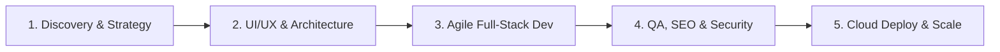

# 
⚡ Solution Tech — Digital Studio & Agency

### *“From Vision to Scale: Engineering High-Impact Web Platforms & Intelligent AI Solutions.”*

[-0078D4?style=for-the-badge&logo=google-maps&logoColor=white)](https://solution-tech1.github.io/SolutionTech-Portfolio/)

---

## 🏢 About Solution Tech

**Solution Tech** is a premier, engineering-driven digital agency based in Karachi, Pakistan, serving global clients across the US, UK, Australia, and worldwide. 

We specialize in architecting **full-stack modern web applications**, **custom high-converting e-commerce systems**, **CMS platforms**, and **cutting-edge Artificial Intelligence (LLM) integrations**. Our mission is to bridge sleek, responsive user experiences with robust, scalable server architectures.

---

## 🛠️ Comprehensive Technology Stack

### 🎨 Frontend & Design System

-F7DF1E?style=flat-square&logo=javascript&logoColor=black)

### ⚙️ Backend, APIs & Core Logic

### 🗄️ Databases & Cloud Architecture
-47A248?style=flat-square&logo=mongodb&logoColor=white)

### 🤖 AI, LLMs & Automation

### 🛍️ CMS & E-Commerce Platforms

### 🚀 DevOps, Hosting & Design Tools

---

## 👥 Meet the Solution Tech Engineering & Growth Team

| Member | Official Role | Focus Area & Specialization | Qualification & Experience |
| :--- | :--- | :--- | :--- |
| **M Raza Rajput** | **CEO & Full-Stack Lead** | Next.js, MERN Stack, AI Integrations & System Architecture | Intermediate in CS • ~2 Years Experience |
| **Abdul Rafay** | **Digital Marketing & Growth Lead** | Performance Marketing, Brand Outreach, UI/UX Strategy & Growth | Intermediate in CS • 6 Months Experience |
| **Hamza Shamsi** | **Full-Stack Developer & Client Lead** | Client Solutions Engineering, Full-Stack Delivery & Data Integrity | Intermediate in Commerce • 1 Year Experience |
| **Aliyan Kaleem** | **Frontend Engineer** | Interactive UI Design, Responsive Components & SEO Architecture | Intermediate • Frontend Specialist |
| **Abdul Rehman** | **MERN Stack Developer** | REST API Engineering, MongoDB Schemas & Frontend Integration | Doing Intermediate • MERN Developer |
| **M Talha** | **CMS & E-Commerce Architect** | Shopify Liquid Storefronts, Custom WordPress & WooCommerce Systems | CMS & E-Commerce Specialist |

---

## 🚀 Featured Live Production Projects

<table>
  <tr>
    <td width="50%">
      <h3 align="center">Nexus AI E-Book Reader</h3>
      
Next.js 15 interactive AI reading platform with real-time assistant, dynamic catalog, and full reader UI.

      

        <a href="https://nexus-ai-book.vercel.app"><b>🔗 Live Demo</b></a> | 
        <a href="https://github.com/Solution-tech1/Nexus-Ai-book"><b>💻 Repository</b></a>
      

    </td>
    <td width="50%">
      <h3 align="center">Earthy Electronics</h3>
      
Modern e-commerce platform for home appliances & electronics with seamless checkout and product filtering.

      

        <a href="https://earthy-electronics.vercel.app/"><b>🔗 Live Demo</b></a> | 
        <a href="https://github.com/Solution-tech1/earthy-electronics"><b>💻 Repository</b></a>
      

    </td>
  </tr>
  <tr>
    <td width="50%">
      <h3 align="center">HealthMate Wellness</h3>
      
AI Telehealth & consultation portal featuring smart patient metrics, analytics, and instant health assistance.

      

        <a href="https://healthmate-frontend-five.vercel.app/"><b>🔗 Live Demo</b></a> | 
        <a href="https://github.com/Solution-tech1/HealthMate"><b>💻 Repository</b></a>
      

    </td>
    <td width="50%">
      <h3 align="center">Luxe Clothing Brand</h3>
      
Full-stack apparel e-commerce web application with CRUD inventory management, cart systems, and auth.

      

        <a href="https://luxe-brand.vercel.app/"><b>🔗 Live Demo</b></a> | 
        <a href="https://github.com/Solution-tech1/drakewears"><b>💻 Repository</b></a>
      

    </td>
  </tr>
  <tr>
    <td width="50%">
      <h3 align="center">CellsPart Store</h3>
      
High-volume e-commerce tech replacement parts catalog and streamlined ordering platform.

      

        <a href="https://cellspart.com"><b>🔗 Live Demo</b></a>
      

    </td>
    <td width="50%">
      <h3 align="center">6 Star Pools Australia</h3>
      
High-converting commercial platform designed for an Australian swimming pool construction agency.

      

        <a href="https://6starpools.au/"><b>🔗 Live Demo</b></a>
      

    </td>
  </tr>
  <tr>
    <td width="50%">
      <h3 align="center">Al Noor Quran Academy</h3>
      
Global online Quran education portal serving international students across the US, UK, and Australia.

      

        <a href="https://www.alnooronlinequranacademy.com/"><b>🔗 Live Demo</b></a>
      

    </td>
    <td width="50%">
      <h3 align="center">Aspect Window Cleaning</h3>
      
Commercial & residential service platform for an Australian property maintenance firm.

      

        <a href="https://aspectwindowcleaning.com.au/"><b>🔗 Live Demo</b></a>
      

    </td>
  </tr>
</table>

---

## ⚙️ Our Engineering & Delivery Workflow

1. **Discovery & Strategy:** Understand client requirements, audience, conversion targets, and technical feasibility.
2. **UI/UX & Prototyping:** Design high-fidelity wireframes, interactive user journeys, and component systems.
3. **Agile Engineering:** Develop clean, modular, and maintainable code adhering to modern SOLID principles.
4. **Testing & Optimization:** Run speed benchmarks, responsive testing across all device viewports, and SEO audits.
5. **Deployment & Scale:** Deploy on zero-downtime global edge CDNs with ongoing monitoring and support.

---

## 📬 Let's Build Something Extraordinary Together!

Are you looking to launch a high-performance web platform, integrate AI into your workflow, or build an e-commerce store? We're available for contract and remote collaborations worldwide.

 

**📍 Headquartered:** Karachi, Pakistan &nbsp;|&nbsp; **🌍 Availability:** Remote Worldwide &nbsp;|&nbsp; **⚡ Response Time:** Within 2 Hours

© 2026 Solution Tech. Engineered with precision.

